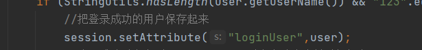

# 登录用户显示
## 层级

## main.html

session.setAttribute("sessionName",Object);
用来设置session值的，sessionName是名称，object是你要保存的对象。
session.getAttribute("sessionName");
用来得到对应名称的session值，即得到object对象，注意需要进行类型转换！

session.setAttribute("xyyyy",xyyy);保存
session.getAttribute("xyyyy");取得
你可以把自己要的数据什么的放在session里面传来传去的，很好玩的~
64626